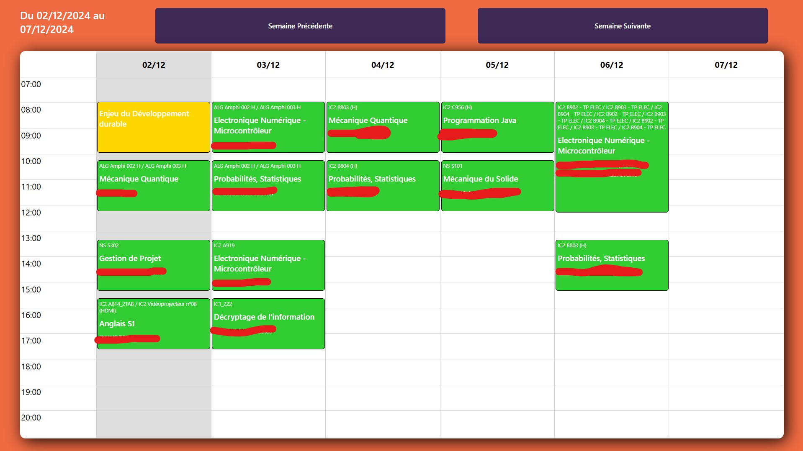
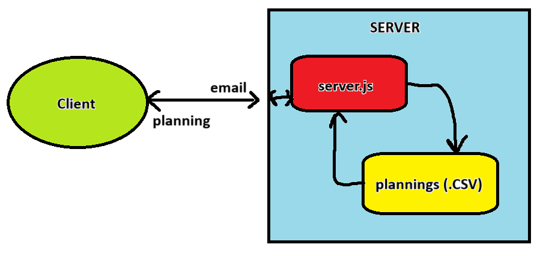

# JUNIA Planning

## I. Introduction
WebAurion has been shutdown in JUNIA School for safety reasons. Students schedules were on this platform and students can't access to a simple version of it. An Excel with schedules for each student, each course is sent weekly.

JUNIA Planning enables JUNIA students to access their planning in a "classic way", with details for each course and quick loading.

## II. How does it work?
JUNIA Planning saves each Excel in a `.CSV` file, which is then used to get the data for users.

When users enter their email adress, the planning page will be sent. On first visit, users will have to wait for the server response to get their complete planning. 
On next visit, planning datas will be saved locally in *local storage* to enable an instant refresh.
In the same time, a background request is made to refresh planning with last datas (in case of modifications).

## Notes

This project won't be useful anymore when WebAurion will be back online.

Meanwhile, the site is still available at this URL : [JUNIA Planning](https://junia-plannings.glitch.me)